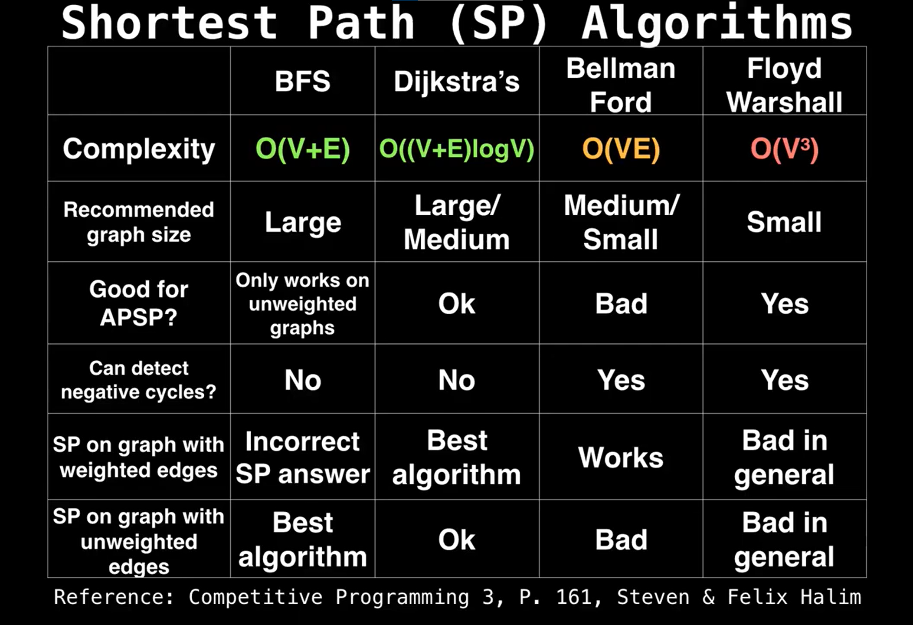
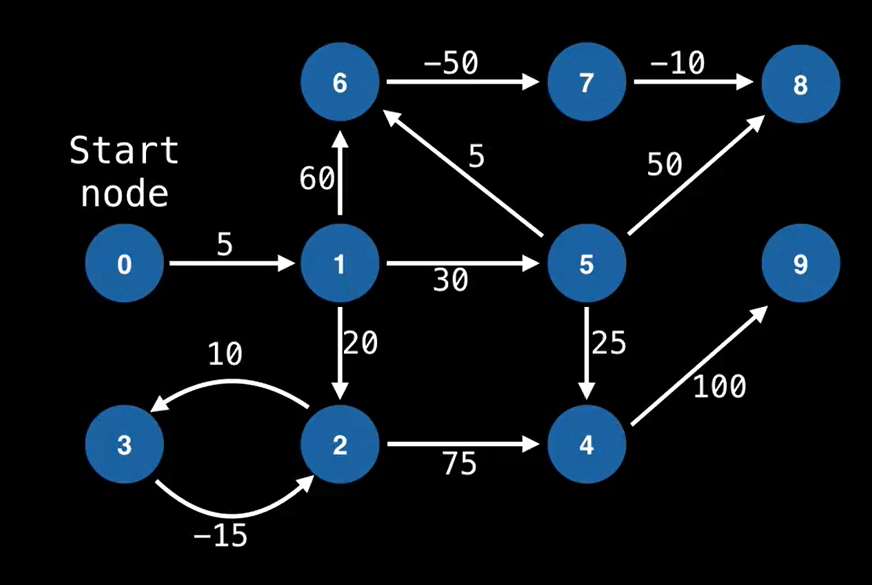
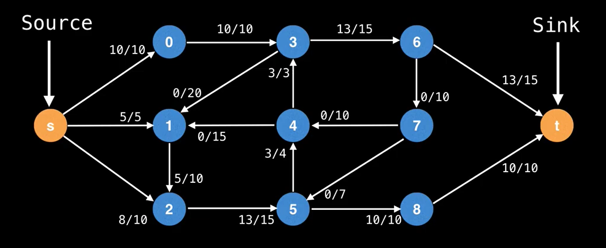
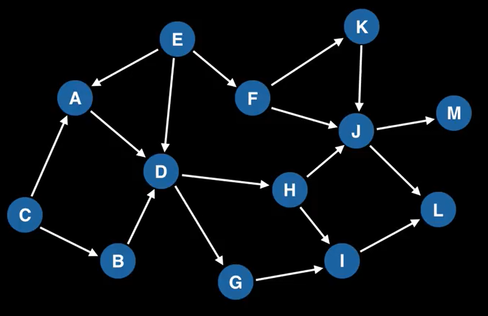

# Learn Optimization

## [Assignment](./assignment/)

1. [Assignment on Optimization Solver](./assignment/assignment_on_solver)

## [Bin Packing](./bin_packing)

1. [Bin Packing on Optimization Solver](./bin_packing/bin_packing_on_solver)

## [Dynamic Programming](./dynamic_programming)

1. [Dynamic Programming on Leetcode](./dynamic_programming/dynamic_programming_leetcode)

## [Graph Theory](./graph_theory)

1. [Shortest Path](./graph_theory/shortest_path)
   
   1. [Single Source Shortest Path](./graph_theory/shortest_path/single_source_shortest_path)
      1. [SSSP on Directed Acycle Graph](./graph_theory/shortest_path/single_source_shortest_path/sssp_on_directed_acycle_graph)
         1. [Shortest Longest Path on DAG](./graph_theory/shortest_path/single_source_shortest_path/sssp_on_directed_acycle_graph/shortest_longest_path_on_DAG.py)
      2. [Dijkstra](./graph_theory/shortest_path/single_source_shortest_path/dijkstra)
         1. [Simple Dijkstra Algorithm](./graph_theory/shortest_path/single_source_shortest_path/dijkstra/simple_Dijkstra_algorithm.py)
         2. [Lazy Dijkstra Algorithm](./graph_theory/shortest_path/single_source_shortest_path/dijkstra/lazy_Dijkstra_algorithm.py)
         3. [Stop Early](./graph_theory/shortest_path/single_source_shortest_path/dijkstra/stop_early.py)
      3. [Bellman Ford Algorithm](./graph_theory/shortest_path/single_source_shortest_path/Bellman_Ford_algorithm)
         
         1. [BF Algorithm](./graph_theory/shortest_path/single_source_shortest_path/Bellman_Ford_algorithm/BF_algorithm.py)
   2. [All Pairs Shortest Path](./graph_theory/shortest_path/all_pairs_shortest_path)
      1. [Floyd-Warshall](./graph_theory/shortest_path/all_pairs_shortest_path/Floyd_Warshall.py)
2. [Netwok Flow](./graph_theory/network_flow)
   1. [Ford-Fulkerson Method](./graph_theory/network_flow/Ford_Fulkerson_method.py)
   2. [Edmonds-Karp Algorithm](./graph_theory/network_flow/Edmonds_Karp_algorithm.py)
   3. [Dinic Algorithm](./graph_theory/network_flow/Dinic_algorithm.py)
   4. [Capacity Scaling](./graph_theory/network_flow/capacity_scaling.py)
      
3. [Topological Sort](./graph_theory/topological_sort)
   
   1. [Topological Sort](./graph_theory/topological_sort/topological_sort.py)
4. [Connected Component](./graph_theory/connected_component)
   1. [Minimum Spanning Tree](./graph_theory/connected_component/minimum_spanning_tree)
      1. [Prim's MST Algorithm](./graph_theory/connected_component/minimum_spanning_tree/lazy_Prims_algorithm.py)
   2. [Bridges and Articulation Points](./graph_theory/connected_component/bridges_and_articulation_points)
      1. [Low Link](./graph_theory/connected_component/bridges_and_articulation_points/low_link.py)
      2. [Articulate Points](./graph_theory/connected_component/bridges_and_articulation_points/articulation_points.py)

## [Artificial Neural Network](./artificial_neural_network)

1. [DIY ANN](./artificial_neural_network/ANN.py)
